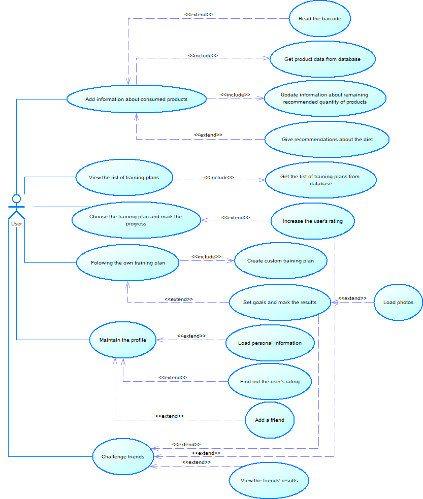

# Pump Yourself

## Idea
"Pump Yourself" is a combination of a workout tracker and a daily meal planning application. You can easily monitor your diet, follow different training plans or take notes about your own physical exercises. You can add your friends in the application and organize competitions between each other. The app also has user profile, fitness goals and personalized tips. Thanks to Pump yourself, you can change your body and soul for the better.

## Requirements
- Requires at least Android 5.0 (API level 21)
- Minimum RAM requirement is 1GB
- Permissions: Contacts, Camera, Microphone, Storage

## Target audience
The target audience for the application Pump yourself - teenagers and older people who want to:
- Start doing sports and achieve some results
- Follow proper nutrition
- Keep body healthy and promoting it improvement

## Use Case diagram

	

